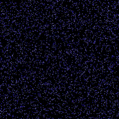

## CellularAutomation by Brian Silverman

### Requirements

 * pip install -r requirements.txt 
 * [ffmpeg](https://www.ffmpeg.org/)


#### [Seeds](https://en.wikipedia.org/wiki/Seeds_(cellular_automaton))
```
python cells.py --name seeds --n_generations 250 --w_width 500 --w_hight 500 --save_video True

```


#### [Brian's Brain](https://en.wikipedia.org/wiki/Brian%27s_Brain)
```
python cells.py --name bbrain --n_generations 250 --w_width 500 --w_hight 500 --save_video True

```



